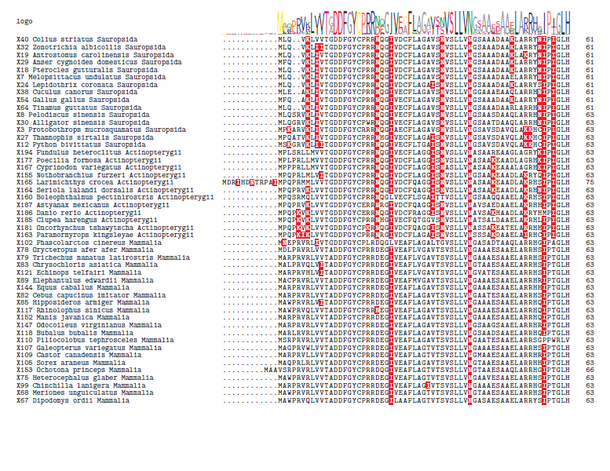
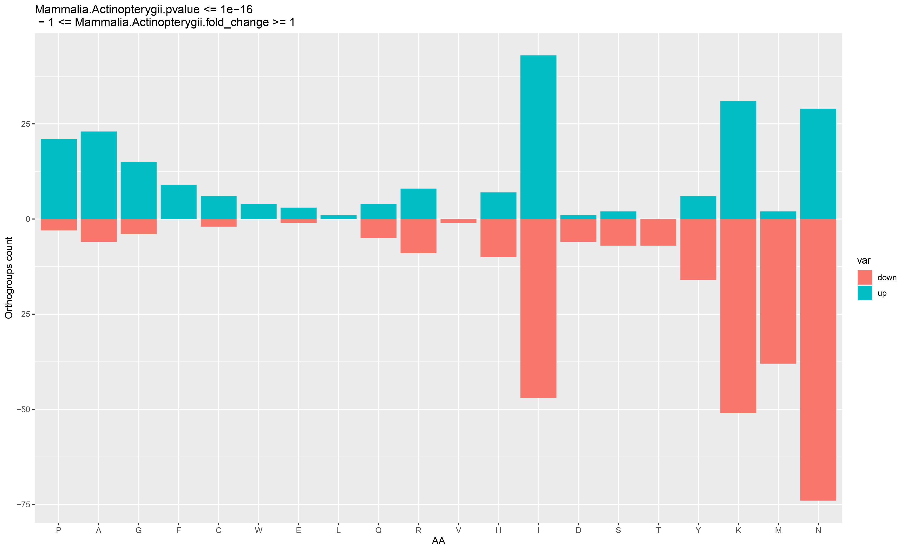
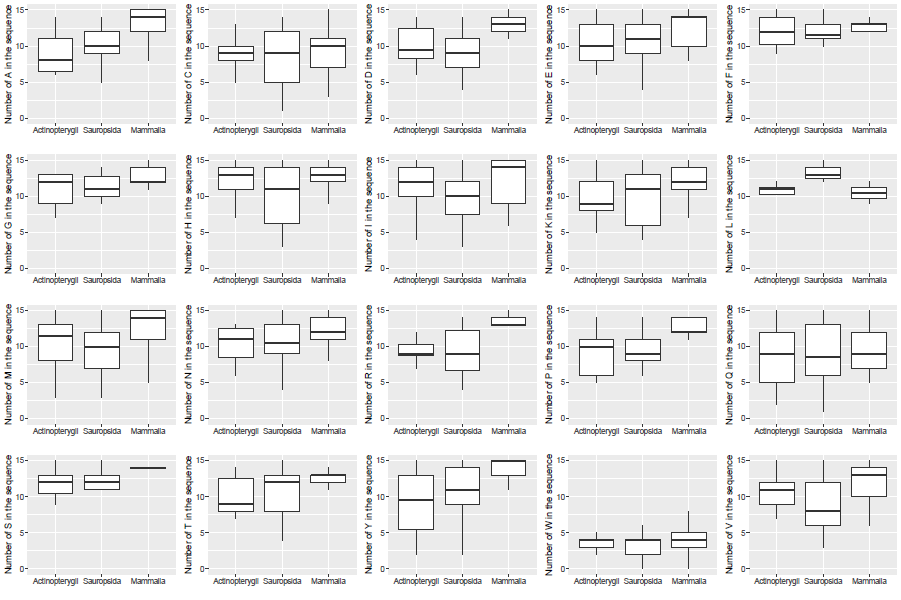
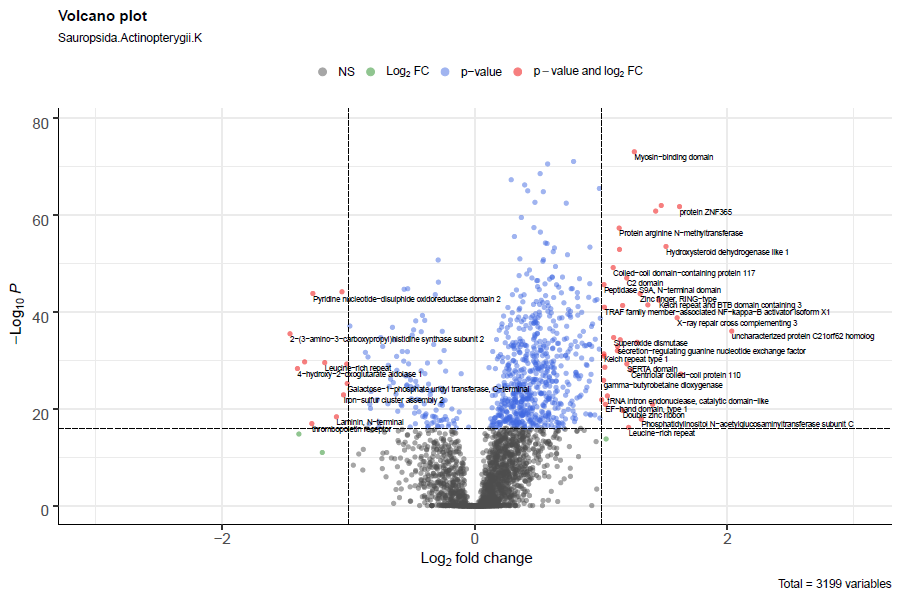

# AA_Comp
## EVOLUTIONARY CHANGES IN AMINOACID COMPOSITION OF ORTHOLOGOUS GENES DURING VERTEBRATES EVOLUTION

# Summary
This project performs an analysis in *R* of amino acid composition of vertebrates orthologous proteins. 
We considered three classes: *Actinopterygii, Sauropsida* and *Mammalia*. The project allows to work also with different types of classifications according to research needs. 

The developed scripts are used for:

- Retrieving data
- Filtering and organizing data
- Conducting statistical analysis 
- Plotting analysis results

# Usage
### [DOWNLOAD *R* SCRIPTS](https://github.com/Percud/AA_Comp/archive/master.zip)
### INSTALL *R* PACKAGES:
```
- rjson
- httr
- Biostrings
- dplyr
```
### GET ORTHOGROUPS INFORMATION AND FASTA SEQUENCES FROM [OrthoDB](https://www.orthodb.org/):
Run script [1- Get_universal_singlecopy_orthogroups.R](https://github.com/Percud/AA_Comp/blob/master/1-%20Get_universal_singlecopy_orthogroups.R).
The program recovers all the orthogroups from the server OrthoDB using API. Parameters: *vertebrate level, single copy gene, orthogroup present in 90% of the species*. 
The program creates a folder named `data` containing three files `.fa` with FASTA sequences.

### OBTAIN AA COUNT OF ORTHOGROUPS AND ORGANIZE DATA INTO DATAFRAMES 
Run script [2a- AA_Comp_Analysis.R](./2a-%20AA_Comp_Analysis.R).
The necessary *funtions* are recovered ([2b- Functions.R](https://github.com/Percud/AA_Comp/blob/master/2b-%20Functions.R)). A dataframe `AA_Comp_nofilter` is created in which the downloaded data are organized. 
Odd data are filtered out and a new dataframe `AA_Comp` is created.

### UNDERSTANDING THE DATASET ***AA_Comp***
The dataset `AA_Comp` contains records of orthologous proteins of the database OrthoDB. Below is a brief **description** of the 30 variables in the dataset:
- `Classification`: group of organisms (Sauropsida-Mammalia-Actinopterygii)
- `seq_id`: unique sequence identifier
- `pub_gene_id`: unique gene identifier
- `pub_og_id`: unique ortholog group identifier
- `og_name`: ortholog group name
- `level`: NCBI taxon identifier of the clade 
- `description`: short description of the ortholog group
- `width`: sequence length
- `seq_seq`: sequence string, without fasta-header 
- name of each AA: count in the sequence


### STATISTICAL ANLYSIS: ***T-TEST*** AND ***Log2 FOLD CHANGE***
In the same script [2a- AA_Comp_Analysis.R](https://github.com/Percud/AA_Comp/blob/master/2a-%20AA_Comp_Analysis.R), the instruction to perform the **statistical analysis** of data is given. 
The program creates a new dataframe `Res` with ***pvalue*** (t-test) and ***Log2 fold change*** results, obtained by **pairwise comparisons** between the three different classes.

### UNDERSTANDING THE DATASET ***Res***
**Description** of the 12 variables:
- `pub_og_id` : unique ortholog group identifier
- `og_name`: ortholog group name
- `AA`: name of the amino acid considered
- `.pvalue`: value of pairwise *t-test*
- `Sauropsida/Mammalia/Actinopterygii`: mean of the relative AA count in the orthogroup
- `.fold_change`: value of pairwise *Log2 fold change*


### MULTIPLE SEQUENCE ALIGNMENT
Install *R* packages: 
```
- DECIPHER
- msa
- odseq
- taxizedb
```
Source script [Align_shade.R](https://github.com/Percud/AA_Comp/blob/master/Utilities/Align_shade.R). Choose the amino acid/amino acids to focus on and write in `aa` . Choose `og_id` of the orthogroup to align. Example: 
```
aa="CDEW"
og_id="238395at7742"
```
Run the script. The program takes the best sequences from each class to align and it creates four files: multiple alignment is in *PDF* file.



### BAR PLOTS
Run script [Barplot.R](https://github.com/Percud/AA_Comp/blob/master/Utilities/Barplot.R). It creates **bar plots with vertical bars** based on **pairwise comparisons**.
Bar plots can be exported from *R* as *image* files.



### BOX PLOTS 
Install *R* packages: 
```
- ggplot2
- dplyr
- gridExtra
- grid
```
Source script [Boxplot.R](https://github.com/Percud/AA_Comp/blob/master/Utilities/Boxplot.R). Choose `pub_og_id` of the orthogroup to focus on and write it in `args`. Run the script. The program creates **box plots** of **amino acids distribution** for each class in *PDF* files. 



### HEATMAP

### VOLCANO PLOTS
Install *R* packages: 
```
- EnhancedVolcano
- Biostrings
```
Run script [VolcanoPlot.R](https://github.com/Percud/AA_Comp/blob/master/Utilities/VolcanoPlot.R). The program creates *PDF* files with the **pairwise comparison plot** related to a **singol amino acid**.




